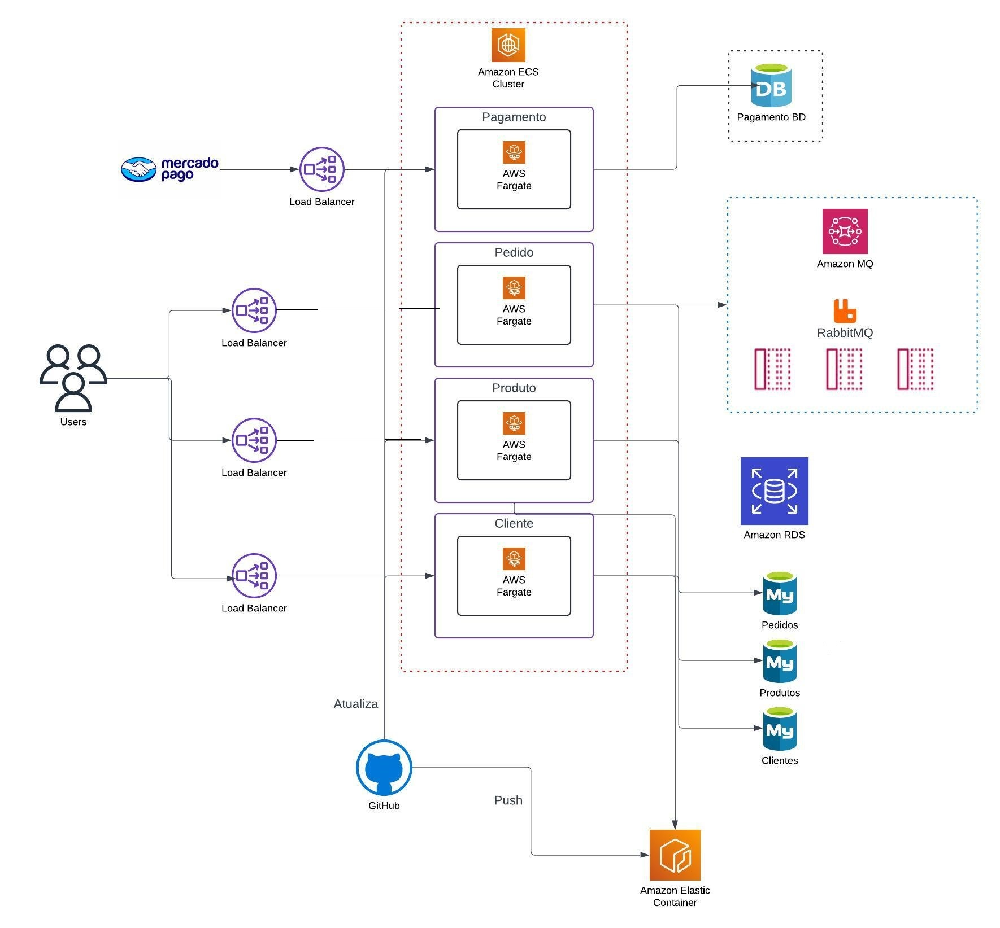

# techChallenge FIAP - G24 FASE 3

Este repositório é focado na infraestrutura Kubernetes utilizando Terraform, com o objetivo de implementar melhorias baseadas nas melhores práticas de CI/CD para a API.

O provisionamento de todos os recursos é executado via GitHub Actions com base nos arquivos Terraform.

## Grupo 24 - Integrantes
💻 *<b>RM355456</b>*: Franciele de Jesus Zanella Ataulo  
💻 *<b>RM355476</b>*: Bruno Luis Begliomini Ataulo  
💻 *<b>RM355921</b>*: Cesar Pereira Moroni  

## Nome Discord:
Franciele RM 355456 
Bruno - RM355476 
Cesar P Moroni RM355921 

.....

A ilustração abaixo representa a arquitetura utilizada, incluindo os microsserviços e suas interações com os bancos de dados e o broker de mensagens.

